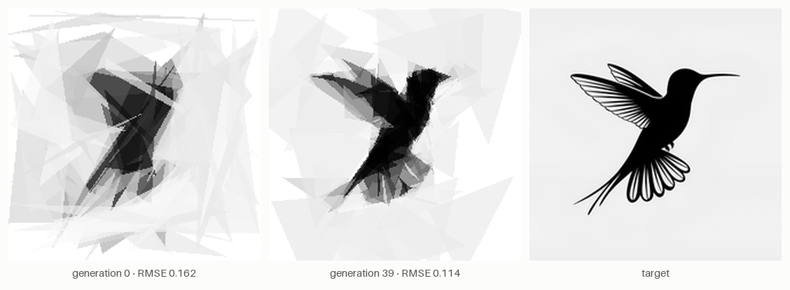
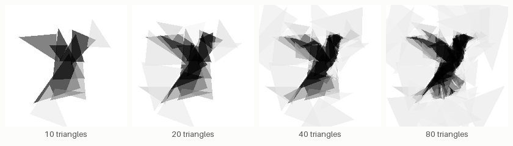
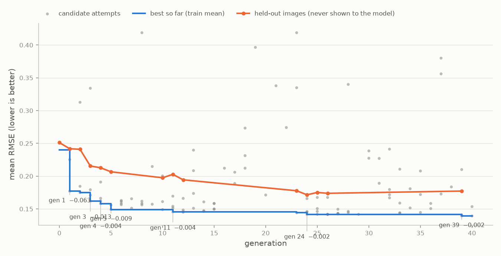

# Triangle Placement Evolution — Local LLM Auto-Research Demo

A locally-run 27B model (via Ollama) autonomously evolves an algorithm,
FunSearch/AlphaEvolve-style: a pure-Python heuristic
`propose_triangle(target, canvas, t, n_total, evaluate, rng)` that approximates
a grayscale target image with a hard budget of **80 translucent triangles** on
a white canvas. A fixed harness rasterizes and scores every candidate (RMSE —
the model cannot fake its score), the model proposes full replacement programs
each generation, and the whole journey is captured as a filmstrip, fitness
curve, progression grid, rationale log, code diffs, and GIF — the target image
visibly "coming into focus" as the heuristic improves.

Everything runs on-device. No cloud inference anywhere.



*The same frozen harness, two versions of one evolved function. Left: the
gen-0 random-search baseline (hummingbird RMSE 0.162). Middle: the champion
found at generation 39 (RMSE 0.114). Right: the target.*



*The champion heuristic's canvas at 10, 20, 40, and 80 triangles — big tonal
blocks first, detail later. Size annealing was the model's own discovery.*



*Mean RMSE across 3 training images (blue, lower is better), every scored
candidate (grey), and 2 held-out images the model never saw (orange). The
run: 0.240 → 0.139, beating a hand-written reference heuristic (0.162) that
was used only to validate headroom.*

## Quickstart

```bash
uv sync                     # install deps (Python 3.12, managed by uv)
uv run python assets/make_targets.py   # procedural second held-out image
uv run pytest               # harness + sandbox + offline loop invariants

uv run python -m triart.evolve --smoke --name pipetest   # fast pipeline check
uv run python -m triart.evolve --name demo               # the real run

uv run python report/make_report.py runs/demo            # all deliverables
open runs/demo/report/report.html
```

Interrupt any run with Ctrl-C; continue it later with
`uv run python -m triart.evolve --resume runs/demo`.

## The task (frozen harness)

- Working resolution **220×220**, budget **N_TRI = 80** triangles, canvas
  starts all-white. A painted triangle composites one gray level `g ∈ [0,1]`
  at fixed opacity **A = 0.65**: `canvas[mask] = canvas[mask]·(1−A) + g·A`.
- Per slot the heuristic gets a budget-limited `evaluate(pts, g=None)` —
  rasterize a triangle, get its exact ΔSSE; `g=None` yields the least-squares
  optimal gray. Hard stop at **K = 45** calls per slot (`BudgetExceeded`).
- **Fitness = RMSE(target, canvas)**, lower is better, averaged over **3
  training images**; **2 held-out images** the model never sees are scored on
  accepted generations (the generalization curve).
- Anti-cheat: the heuristic returns an `evaluate` result tuple, but the harness
  re-rasterizes from `pts` and `g`, recomputes the true ΔSSE itself, and paints
  only if it is negative — scores come from pixels, not claims.
- Sandbox: numpy-only imports, AST-validated, crash-isolated subprocess,
  120 s wall cap per image; any exception → worst-case fitness, logged and fed
  back to the model next generation.

## Evolution loop (fixed)

Gen 0 is a naive baseline (random vertices, random gray, best of K). Each
generation the model sees the contract, the 2–3 best programs with fitness,
one weaker program for contrast, a short score history, and error feedback from
failed siblings, then proposes 4 candidates on a temperature ladder — each a
full replacement program with a one-paragraph rationale (logged for the demo
narrative). Candidates are AST-validated, screened cheaply (20 triangles),
then fully scored in a sandbox. Selection keeps the top-6 programs by mean
RMSE; after 3 stagnant generations the prompt escalates to bold-rewrite mode,
one candidate restarts from the naive baseline for diversity, and the
(vision-capable) model is shown a canvas-vs-target image of its own output.

## Layout

```
config.yaml          all knobs: model, task, budgets, smoke profile
triart/              config, targets, score, raster, harness, sandbox,
                     llm (native Ollama API), prompts, baseline, evolve
report/make_report.py  filmstrip / fitness curve / progression / GIF /
                       rationales / diffs / HTML
assets/train|holdout   target images (falls back to synthetics)
runs/<name>/         per-generation code, scores, canvases, log.jsonl, state.json
```

## Model

`config.yaml` names `qwen3.8:27b` with fallbacks; the first model actually
installed on the Ollama server is used. Thinking mode is disabled via the
native API's `think: false` for ~3x faster candidates; flip
`model.thinking: true` to trade speed for possibly smarter proposals.
